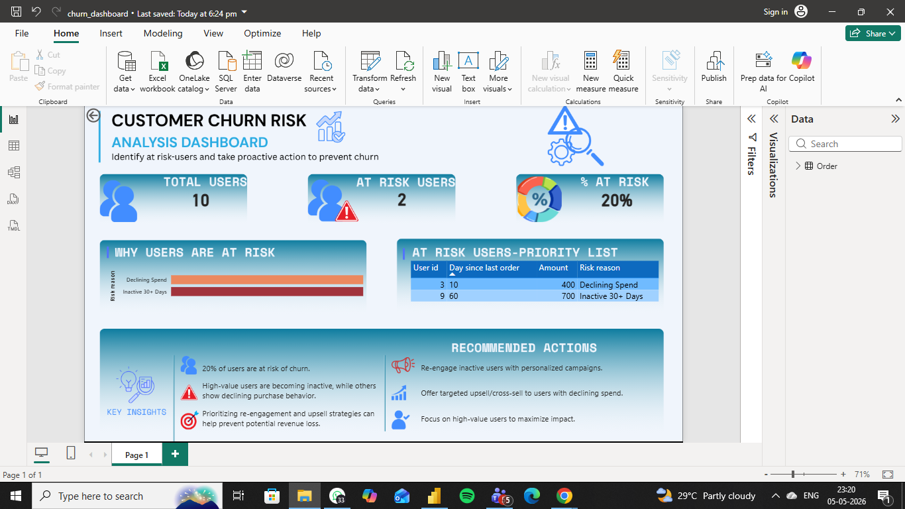

# 📊 Customer Churn Risk Analysis Dashboard
## 📊 Dashboard Preview

## 📌 Business Problem

Customer churn directly impacts revenue. The goal of this project is to identify users at risk of churn and recommend actions to retain them.

---

## 📊 Dataset

Transaction-level dataset containing:

* `user_id`
* `order_id`
* `order_date`
* `amount`

---

## 🧠 Approach

### 1. Data Cleaning

* Removed invalid dates
* Removed negative/refund amounts
* Eliminated duplicate records

### 2. Feature Engineering

* Converted event-level data to **user-level**
* Used SQL window functions:

  * `ROW_NUMBER()` → sequence purchases
  * `LAG()` → track previous order behavior

### 3. Risk Identification

Users are marked as **at risk** if:

* No purchase in the last **30 days** *(Inactivity)*
* Last two purchases show **declining spend**

---

## 📈 Key Insights

* **20% of users are at risk of churn**
* High-value users are becoming inactive
* Some users show consistent decline in spending behavior

---

## 🎯 Business Recommendations

* Re-engage inactive users with personalized campaigns
* Use upsell/cross-sell strategies for declining users
* Prioritize high-value users to maximize impact

---

## 📊 Dashboard Features

* KPI cards (Total Users, At-Risk Users, % At Risk)
* Risk distribution by reason
* Priority list of at-risk users
* Key insights and recommended actions

---

## 🛠️ Tools Used

* SQL (Data cleaning & transformation)
* Power BI (Dashboard & visualization)

---

## 📂 Project Structure

```
customer-churn-analysis/
│
├── churn_analysis.sql
├── churn_dashboard.pbix
├── orders.csv
├── README.md
```

---

## 🚀 How to Use

1. Open SQL file to understand data transformation logic
2. Load dataset into Power BI
3. Open `.pbix` file to explore dashboard

---

## 📌 Future Improvements

* Include user segmentation (high/low value users)
* Add time-based churn prediction
* Scale analysis with larger datasets

---
